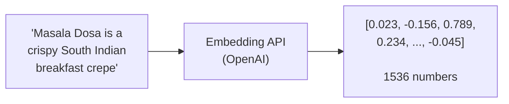
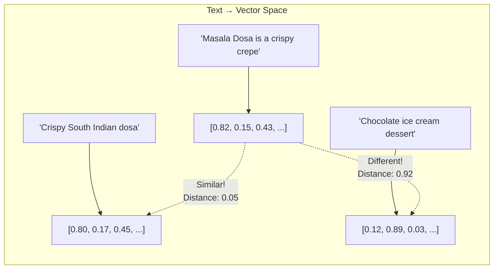
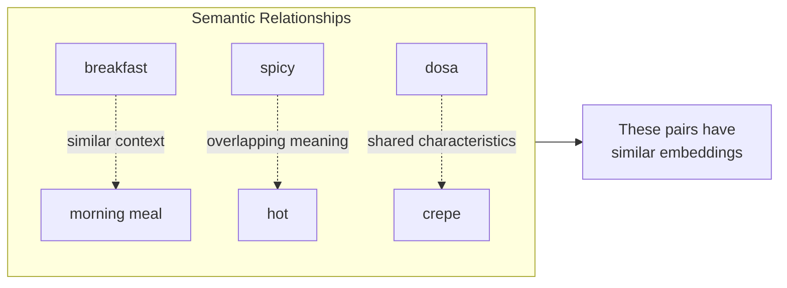

# Embeddings

Embeddings are the bridge between human language and vector databases. They convert text into numbers that capture meaning.

## What is an Embedding?

An embedding is a **numerical representation of text** that captures its semantic meaning.



Similar texts produce similar vectors:



## How Embeddings Capture Meaning

Embedding models are trained on billions of text samples. They learn that:

- "breakfast" and "morning meal" often appear in similar contexts
- "spicy" and "hot" have overlapping meanings
- "dosa" and "crepe" share characteristics



This training produces vectors where **semantic similarity = vector similarity**.

## Using OpenAI Embeddings

We use OpenAI's `text-embedding-3-small` model:

```python
from openai import OpenAI

client = OpenAI()

response = client.embeddings.create(
    model="text-embedding-3-small",
    input="Idli is a soft, fluffy steamed rice cake from South India"
)

embedding = response.data[0].embedding
print(f"Dimensions: {len(embedding)}")  # 1536
print(f"First 5 values: {embedding[:5]}")  # [0.023, -0.156, ...]
```

## Embedding Our Food Data

When we ingest our food database:

```python
# Each dish gets embedded
for dish in dishes:
    # Create a rich text description
    text = f"""
    {dish['name']}: {dish['description']}
    Cuisine: {dish['cuisine']}
    Ingredients: {', '.join(dish['ingredients'])}
    Good for: {dish['meal_type']}
    """
    
    # Generate embedding
    embedding = get_embedding(text)
    
    # Store in ChromaDB
    collection.add(
        ids=[dish['id']],
        embeddings=[embedding],
        documents=[text],
        metadatas=[dish]
    )
```

## Similarity Measurement

We measure similarity using **cosine similarity**:

```
              A · B
cos(θ) = ─────────────
          |A| × |B|

Where:
- A · B = dot product of vectors
- |A|, |B| = magnitudes of vectors
- Result: -1 (opposite) to 1 (identical)
```

You don't need to calculate this yourself - ChromaDB does it automatically.

```python
# ChromaDB handles similarity
results = collection.query(
    query_texts=["light breakfast"],  # Gets embedded automatically
    n_results=5
)
# Returns dishes ranked by similarity
```

## Embedding Strategies

### What to Embed

For each dish, we create a **rich text representation**:

```python
def create_dish_embedding_text(dish):
    return f"""
    {dish['name']} - {dish['description']}
    
    Cuisine: {dish['cuisine']}
    Region: {dish['region']}
    Type: {dish['meal_type']}
    
    Ingredients: {', '.join(dish['ingredients'])}
    
    Characteristics: {dish['spice_level']} spice, 
    {dish['prep_time']} minutes to prepare,
    {'high protein' if dish['is_high_protein'] else ''},
    {'low carb' if dish['is_low_carb'] else ''}
    """
```

The more context we include, the better the semantic matching.

### When to Re-embed

You need to re-embed when:

- You update dish descriptions
- You add new dishes
- You change the embedding model

You **don't** need to re-embed when:

- You change metadata (allergens, spice level)
- Users update preferences
- You modify the LLM prompts

## Cost Considerations

OpenAI embedding costs (as of 2024):

| Model | Cost per 1M tokens |
|-------|-------------------|
| text-embedding-3-small | $0.02 |
| text-embedding-3-large | $0.13 |

For our 57-dish database:

- Average 100 tokens per dish description
- Total: ~5,700 tokens to embed all dishes
- Cost: **$0.0001** (basically free)

Each user query also needs embedding (~20 tokens), but even with thousands of queries, embedding costs are negligible.

## Key Takeaways

1. **Embeddings convert text to vectors** that capture meaning
2. **Similar meanings = similar vectors** - enables semantic search
3. **OpenAI provides easy-to-use embedding APIs**
4. **Embed rich descriptions** for better matching

---

Next, let's understand MCP - the protocol for giving AI access to tools.
