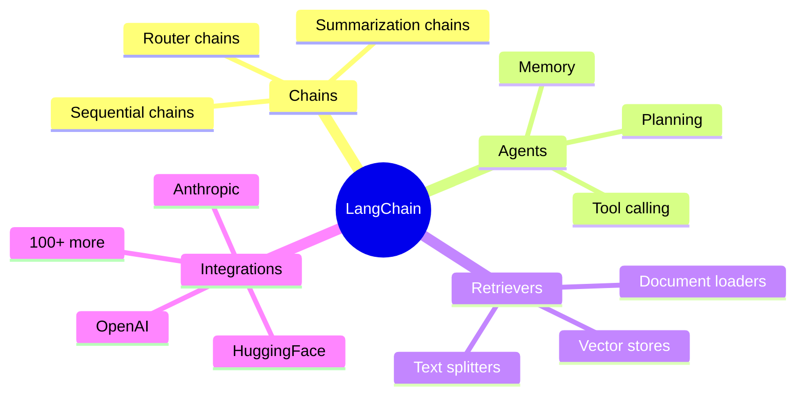
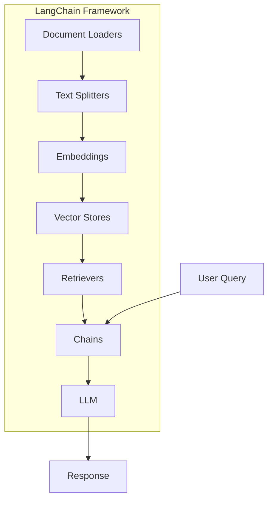
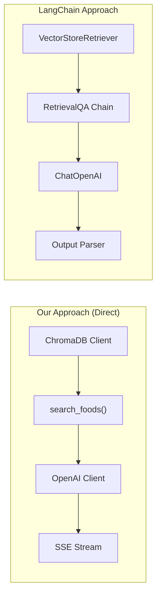
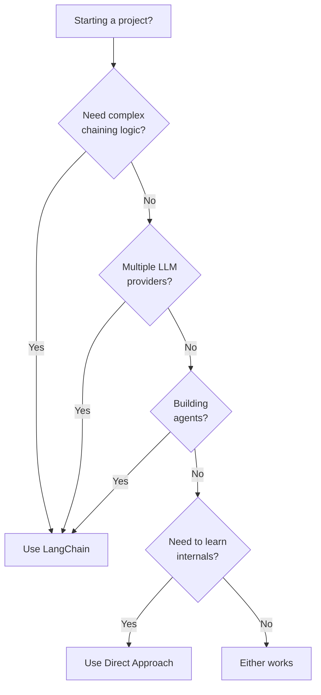
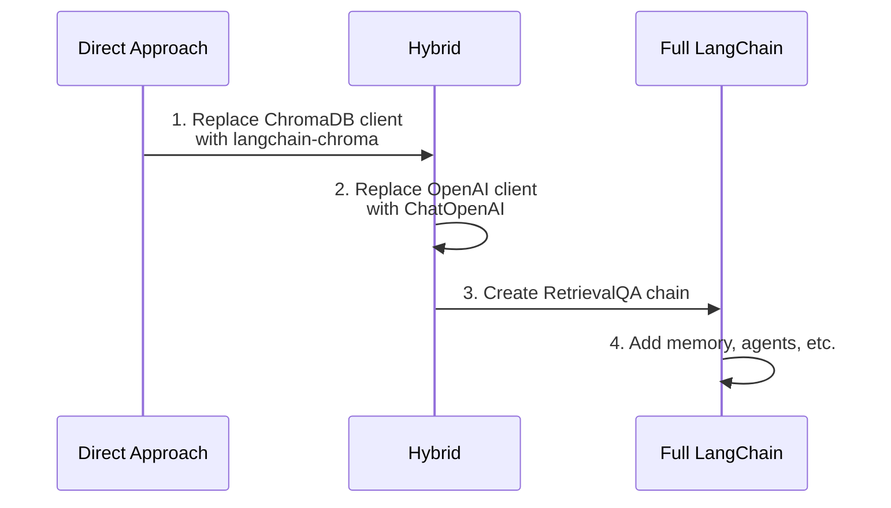

# LangChain and Alternatives

This project includes LangChain in its dependencies but intentionally uses a **lightweight, direct approach** for core functionality. Understanding why helps you make informed decisions for your own projects.

## What is LangChain?

LangChain is a popular framework for building LLM applications. It provides:



## LangChain Architecture



## Why We Use Direct Implementation

This project takes a different approach:



### Comparison

| Aspect | Direct Approach | LangChain |
|--------|-----------------|-----------|
| **Learning curve** | Lower - plain Python | Higher - framework concepts |
| **Control** | Full control over every step | Abstracted, less visibility |
| **Dependencies** | Minimal | Heavy (many sub-packages) |
| **Debugging** | Straightforward | Can be opaque |
| **Flexibility** | Maximum | Framework constraints |
| **Best for** | Understanding internals | Rapid prototyping |

## When to Use LangChain

LangChain excels when you need:



**Use LangChain when:**

- Building complex agent systems
- Need to switch between LLM providers quickly
- Want pre-built chains (summarization, QA, etc.)
- Rapid prototyping without deep customization

**Use Direct Approach when:**

- Learning how LLM applications work
- Need maximum control over behavior
- Want minimal dependencies
- Building production systems with specific requirements

## Our Hybrid Approach

We include LangChain in `pyproject.toml` for potential future use:

```python title="pyproject.toml (relevant deps)"
dependencies = [
    # Core (what we actually use)
    "chromadb>=1.4.1",
    "openai>=1.63.0",
    
    # Available but not primary (for extensions)
    "langchain>=0.3.18",
    "langchain-openai>=0.3.5",
    "langchain-chroma>=0.2.2",
]
```

This lets you:

1. Learn with the direct approach
2. Optionally refactor to LangChain later
3. Use LangChain for specific features (like document loaders)

## Code Comparison

### Direct Approach (What We Use)

```python title="app/rag/retriever.py"
import chromadb

def search_foods(query: str, **filters) -> list[dict]:
    client = chromadb.HttpClient(host="localhost", port=8000)
    collection = client.get_collection("foods")
    
    results = collection.query(
        query_texts=[query],
        n_results=5,
        where=build_filters(filters),
    )
    
    return format_results(results)
```

### LangChain Equivalent

```python title="Alternative with LangChain"
from langchain_chroma import Chroma
from langchain_openai import OpenAIEmbeddings

def search_foods_langchain(query: str) -> list[dict]:
    vectorstore = Chroma(
        collection_name="foods",
        embedding_function=OpenAIEmbeddings(),
    )
    
    retriever = vectorstore.as_retriever(search_kwargs={"k": 5})
    docs = retriever.invoke(query)
    
    return [{"content": d.page_content, "metadata": d.metadata} for d in docs]
```

## Converting to LangChain

If you want to migrate later, here's a path:



### Step 1: Replace Vector Store

```python
# Before
from chromadb import HttpClient
client = HttpClient(host="localhost", port=8000)

# After
from langchain_chroma import Chroma
from langchain_openai import OpenAIEmbeddings
vectorstore = Chroma(
    client=client,
    embedding_function=OpenAIEmbeddings()
)
```

### Step 2: Use LangChain LLM

```python
# Before
from openai import AsyncOpenAI
client = AsyncOpenAI()
response = await client.chat.completions.create(...)

# After
from langchain_openai import ChatOpenAI
llm = ChatOpenAI(model="gpt-4o-mini", streaming=True)
response = await llm.ainvoke(messages)
```

### Step 3: Create Chain

```python
from langchain.chains import RetrievalQA

chain = RetrievalQA.from_chain_type(
    llm=llm,
    chain_type="stuff",
    retriever=vectorstore.as_retriever(),
)

response = chain.invoke({"query": "spicy breakfast"})
```

## Summary

| Our Project | Why |
|-------------|-----|
| Uses direct ChromaDB | Maximum control, clear code paths |
| Uses direct OpenAI | Simple streaming, no abstractions |
| Includes LangChain deps | Future flexibility, optional use |
| MCP for tools | Standard protocol, not LangChain agents |

This approach prioritizes **learning** and **understanding** over convenience. Once you understand how everything works, you can make informed decisions about when LangChain's abstractions help vs. hinder.

---

Next, let's dive deep into each file of the backend.
