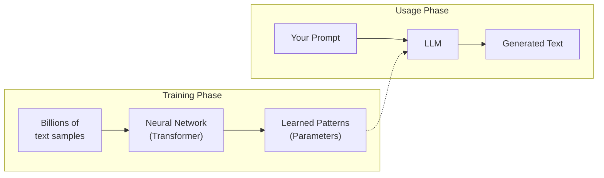
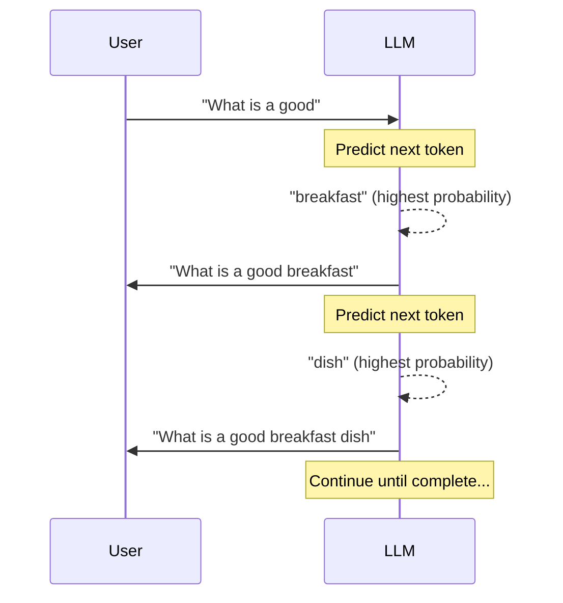
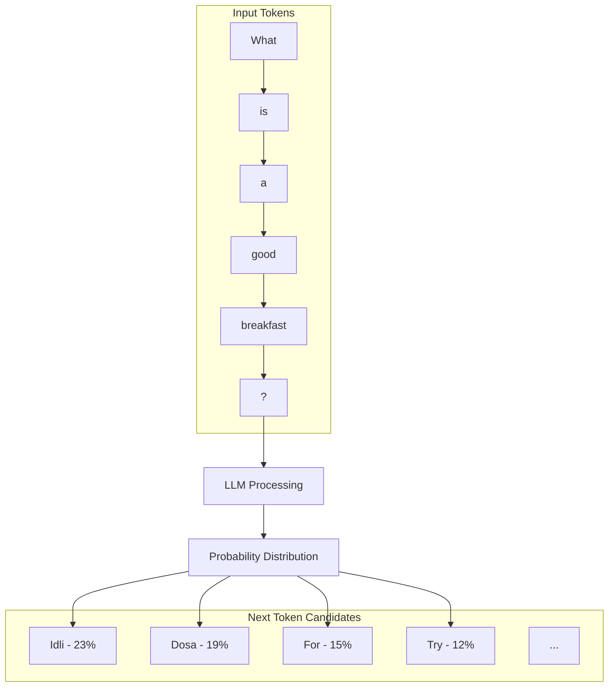

# Understanding LLMs

Before we dive into code, let's understand what Large Language Models (LLMs) are and how we'll use them.

## What is an LLM?

An LLM is an AI model trained on vast amounts of text data. It learns patterns in language and can:

- **Generate text** - Write responses, articles, code
- **Answer questions** - Based on its training data
- **Follow instructions** - Complete tasks you describe
- **Reason** - Work through problems step by step



Popular LLMs include:

- OpenAI's GPT-4, GPT-4o, GPT-4o-mini
- Anthropic's Claude
- Meta's Llama
- Google's Gemini

## How LLMs Work (Simplified)

LLMs predict the next token (word/subword) based on all previous tokens:



The LLM doesn't "understand" in the human sense - it predicts what text should come next based on patterns learned during training.

## Token Prediction Visualization



## The OpenAI API

We'll use OpenAI's API to access GPT-4o-mini. Here's what an API call looks like:

```python
from openai import OpenAI

client = OpenAI(api_key="sk-...")

response = client.chat.completions.create(
    model="gpt-4o-mini",
    messages=[
        {"role": "system", "content": "You are a helpful assistant."},
        {"role": "user", "content": "What's idli?"}
    ]
)

print(response.choices[0].message.content)
# "Idli is a traditional South Indian breakfast dish..."
```

### Message Roles

| Role | Purpose |
|------|---------|
| `system` | Sets the AI's personality and instructions |
| `user` | The human's message |
| `assistant` | The AI's previous responses (for context) |

### Conversation History

LLMs are stateless - they don't remember previous conversations. To maintain context, you send the entire conversation history with each request:

```python
messages = [
    {"role": "system", "content": "You are an Indian food expert."},
    {"role": "user", "content": "What's idli?"},
    {"role": "assistant", "content": "Idli is a steamed rice cake..."},
    {"role": "user", "content": "How do I make it?"},  # New question
]
```

## Streaming Responses

Instead of waiting for the entire response, we can stream it token by token:

```python
stream = client.chat.completions.create(
    model="gpt-4o-mini",
    messages=messages,
    stream=True  # Enable streaming
)

for chunk in stream:
    if chunk.choices[0].delta.content:
        print(chunk.choices[0].delta.content, end="")
```

This creates the "typing" effect you see in ChatGPT.

## Limitations of LLMs

LLMs have important limitations:

1. **Knowledge cutoff** - They only know what was in their training data
2. **Hallucinations** - They can confidently state incorrect information
3. **No real-time data** - They can't access the internet or databases
4. **Context limits** - They can only process a limited amount of text

### How We Solve These

This is where **RAG (Retrieval-Augmented Generation)** comes in. Instead of relying on the LLM's training data, we:

1. Store our curated food database
2. Retrieve relevant dishes based on the user's query
3. Include those dishes in the prompt
4. Let the LLM generate a response using our data

This gives us:

- **Accuracy** - Recommendations from our verified database
- **Control** - We decide what information the LLM can access
- **Freshness** - We can update our database anytime

---

Next, let's understand RAG in detail.
