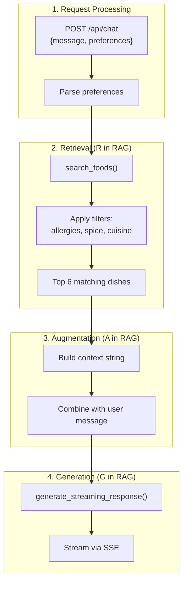
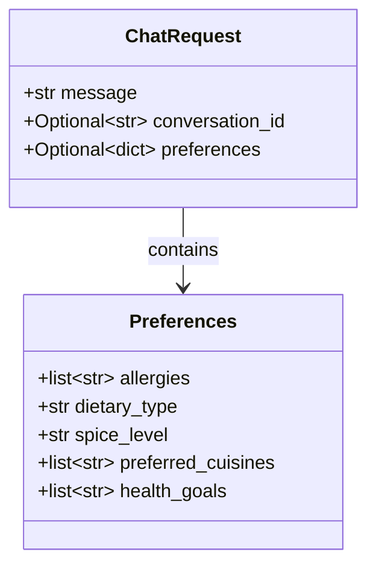
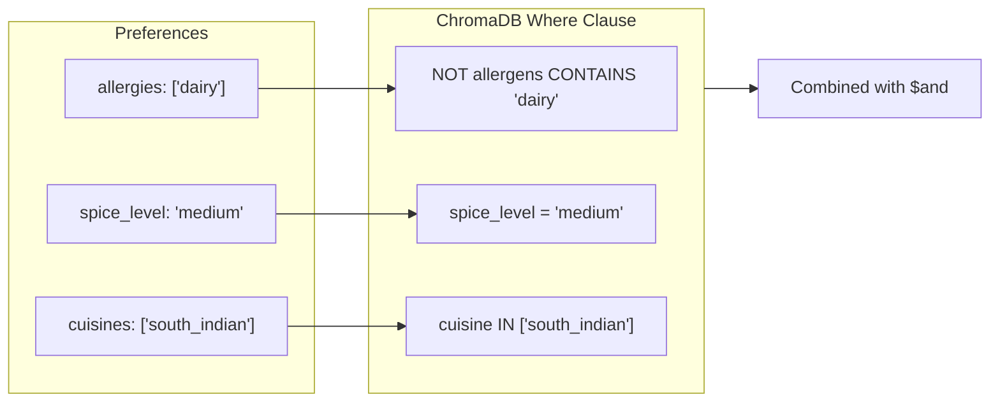
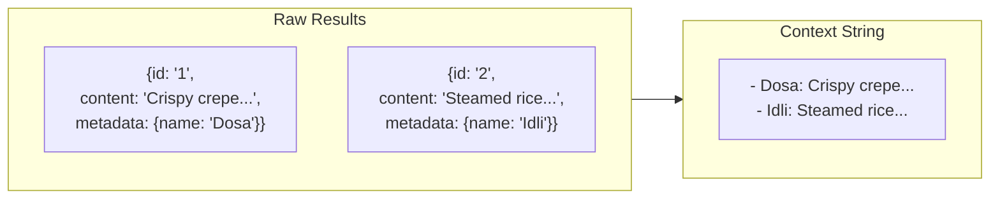
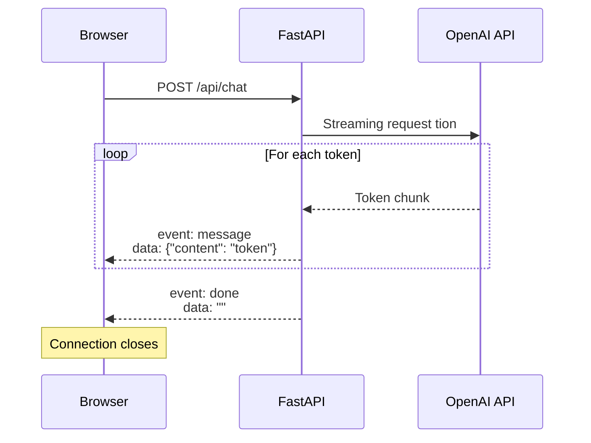

# chat.py - The Chat Endpoint

This is where the magic happens. The chat endpoint receives user messages, searches for relevant dishes, and streams AI responses.

## Complete Source

```python title="backend/app/api/chat.py"
from typing import Optional
from pydantic import BaseModel
from fastapi import APIRouter
from sse_starlette.sse import EventSourceResponse

from app.rag import search_foods
from app.llm import generate_streaming_response

router = APIRouter()


class ChatRequest(BaseModel):
    message: str
    conversation_id: Optional[str] = None
    preferences: Optional[dict] = None


@router.post("/chat")
async def chat(request: ChatRequest):
    prefs = request.preferences or {}
    
    # Search for relevant foods with preference filtering
    foods = search_foods(
        query=request.message,
        allergies=prefs.get("allergies", []),
        dietary_type=prefs.get("dietary_type"),
        cuisines=prefs.get("preferred_cuisines", []),
        spice_level=prefs.get("spice_level"),
        n_results=6,
    )
    
    # Build context from retrieved foods
    context = ""
    if foods:
        context_parts = []
        for f in foods:
            meta = f.get("metadata", {})
            context_parts.append(
                f"- {meta.get('name', 'Unknown')}: {f.get('content', '')}"
            )
        context = "\n".join(context_parts)
    
    messages = [{"role": "user", "content": request.message}]
    
    async def event_generator():
        async for chunk in generate_streaming_response(messages, context):
            import json
            yield {"event": "message", "data": json.dumps({"content": chunk})}
        yield {"event": "done", "data": ""}
    
    return EventSourceResponse(event_generator())
```

## The RAG Flow



## Request Schema



```python
class ChatRequest(BaseModel):
    message: str                          # Required: "spicy breakfast"
    conversation_id: Optional[str] = None # Optional: for chat history
    preferences: Optional[dict] = None    # Optional: user preferences
```

Pydantic validates the request automatically:

- Missing `message` → 422 error
- Wrong type → 422 error with details
- Extra fields → Ignored (by default)

## Preference Filtering

```python
foods = search_foods(
    query=request.message,
    allergies=prefs.get("allergies", []),      # ["dairy", "nuts"]
    dietary_type=prefs.get("dietary_type"),    # "vegan"
    cuisines=prefs.get("preferred_cuisines", []), # ["south_indian"]
    spice_level=prefs.get("spice_level"),      # "medium"
    n_results=6,
)
```

Each preference maps to a ChromaDB filter:



## Context Building

```python
context = ""
if foods:
    context_parts = []
    for f in foods:
        meta = f.get("metadata", {})
        context_parts.append(
            f"- {meta.get('name', 'Unknown')}: {f.get('content', '')}"
        )
    context = "\n".join(context_parts)
```

This transforms search results into a prompt-friendly format:



## Server-Sent Events (SSE)



```python
async def event_generator():
    async for chunk in generate_streaming_response(messages, context):
        import json
        yield {"event": "message", "data": json.dumps({"content": chunk})}
    yield {"event": "done", "data": ""}

return EventSourceResponse(event_generator())
```

**SSE Format:**

```
event: message
data: {"content": "Based"}

event: message
data: {"content": " on"}

event: message
data: {"content": " your"}

event: done
data: 
```

## Why SSE over WebSockets?

| Feature | SSE | WebSocket |
|---------|-----|-----------|
| Direction | Server → Client only | Bidirectional |
| Complexity | Simple HTTP | Protocol upgrade |
| Reconnection | Automatic | Manual |
| Use case | Streaming responses | Real-time chat |

For our use case (streaming AI responses), SSE is simpler and sufficient.

## Error Handling

The current implementation is minimal. Here's how to improve it:

```python
@router.post("/chat")
async def chat(request: ChatRequest):
    try:
        prefs = request.preferences or {}
        
        if not request.message.strip():
            raise HTTPException(400, "Message cannot be empty")
        
        foods = search_foods(...)
        
        async def event_generator():
            try:
                async for chunk in generate_streaming_response(...):
                    yield {"event": "message", "data": json.dumps({"content": chunk})}
                yield {"event": "done", "data": ""}
            except Exception as e:
                yield {"event": "error", "data": json.dumps({"error": str(e)})}
        
        return EventSourceResponse(event_generator())
        
    except HTTPException:
        raise
    except Exception as e:
        raise HTTPException(500, f"Internal error: {str(e)}")
```

---

Next, let's examine the RAG retriever.
