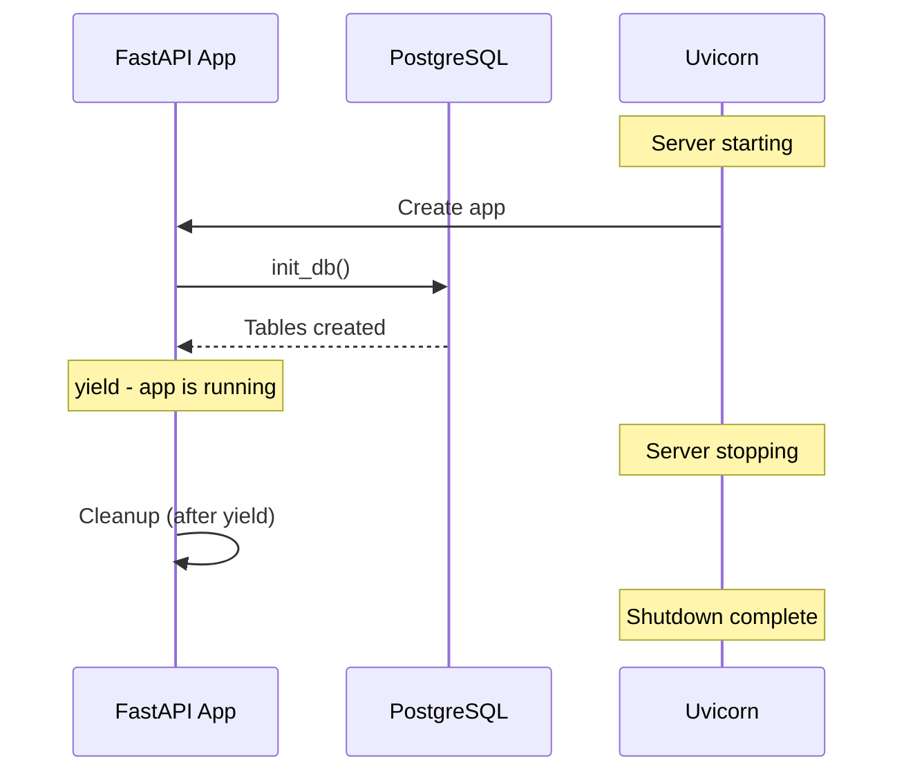
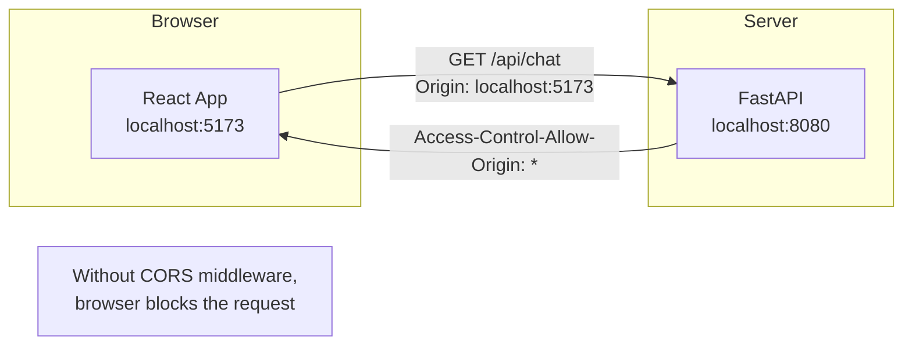
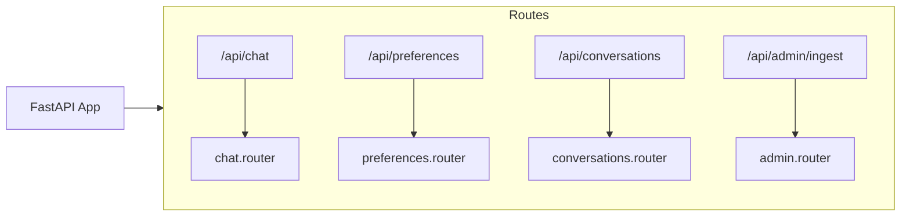
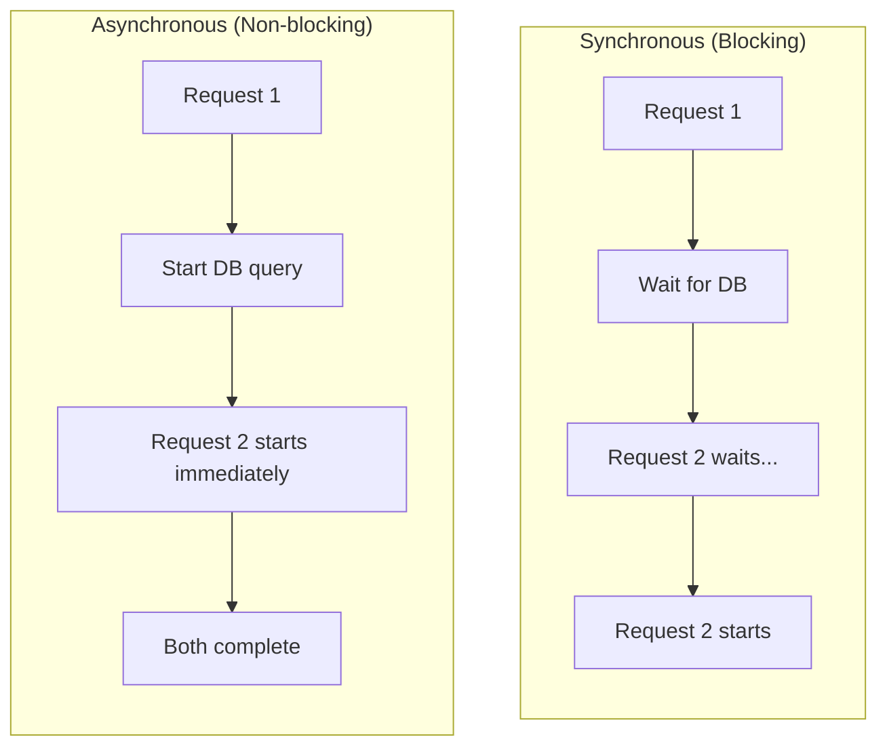
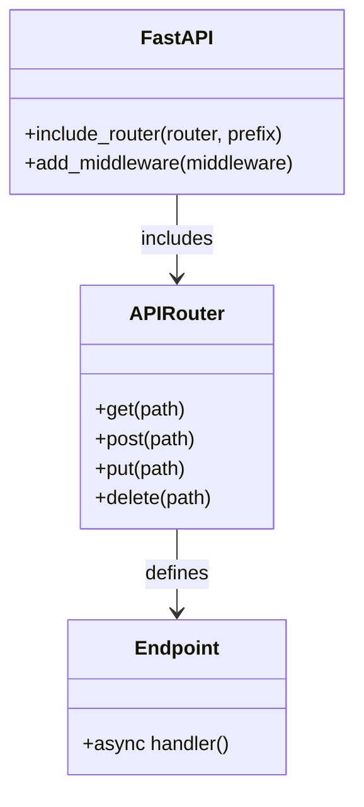

# main.py - Application Entry Point

This file bootstraps the entire FastAPI application. Let's examine every line.

## Complete Source

```python title="backend/app/main.py"
from contextlib import asynccontextmanager
from fastapi import FastAPI
from fastapi.middleware.cors import CORSMiddleware

from app.api import chat, preferences, conversations, admin
from app.db.database import init_db


@asynccontextmanager
async def lifespan(app: FastAPI):
    await init_db()
    yield


app = FastAPI(
    title="Food Recommendation API",
    description="AI-powered Indian vegetarian food recommendations",
    version="1.0.0",
    lifespan=lifespan,
)

app.add_middleware(
    CORSMiddleware,
    allow_origins=["http://localhost:5173", "http://localhost:3000", "*"],
    allow_credentials=True,
    allow_methods=["*"],
    allow_headers=["*"],
)

app.include_router(chat.router, prefix="/api", tags=["chat"])
app.include_router(preferences.router, prefix="/api", tags=["preferences"])
app.include_router(conversations.router, prefix="/api", tags=["conversations"])
app.include_router(admin.router, prefix="/api/admin", tags=["admin"])


@app.get("/health")
async def health_check():
    return {"status": "healthy", "service": "food-api"}


@app.get("/")
async def root():
    return {
        "name": "Food Recommendation API",
        "version": "1.0.0",
        "docs": "/docs",
    }
```

## Line-by-Line Breakdown

### Imports

```python
from contextlib import asynccontextmanager
```

The `asynccontextmanager` decorator lets us create async context managers for the lifespan pattern.

```python
from fastapi import FastAPI
from fastapi.middleware.cors import CORSMiddleware
```

Core FastAPI imports. CORS middleware is essential for frontend-backend communication.

```python
from app.api import chat, preferences, conversations, admin
from app.db.database import init_db
```

Import our API routers and database initialization function.

### Lifespan Pattern



```python
@asynccontextmanager
async def lifespan(app: FastAPI):
    # Startup: runs before app accepts requests
    await init_db()
    yield
    # Shutdown: runs after app stops (nothing here yet)
```

The lifespan pattern replaced the older `@app.on_event("startup")` approach. It's cleaner and allows proper resource cleanup.

### FastAPI Instance

```python
app = FastAPI(
    title="Food Recommendation API",
    description="AI-powered Indian vegetarian food recommendations",
    version="1.0.0",
    lifespan=lifespan,
)
```

This creates the FastAPI application with:

- **title/description**: Shown in auto-generated docs at `/docs`
- **version**: API versioning
- **lifespan**: Our startup/shutdown handler

### CORS Middleware



```python
app.add_middleware(
    CORSMiddleware,
    allow_origins=["http://localhost:5173", "http://localhost:3000", "*"],
    allow_credentials=True,
    allow_methods=["*"],
    allow_headers=["*"],
)
```

CORS (Cross-Origin Resource Sharing) allows the frontend to call the backend:

- **allow_origins**: Which domains can make requests
- **allow_credentials**: Allow cookies/auth headers
- **allow_methods**: GET, POST, etc.
- **allow_headers**: Custom headers like Authorization

:::warning Production Security
In production, replace `"*"` with your actual domain:

```python
allow_origins=["https://yourapp.com"]
```

:::

### Router Registration



```python
app.include_router(chat.router, prefix="/api", tags=["chat"])
app.include_router(preferences.router, prefix="/api", tags=["preferences"])
app.include_router(conversations.router, prefix="/api", tags=["conversations"])
app.include_router(admin.router, prefix="/api/admin", tags=["admin"])
```

Each router is a modular group of endpoints:

- **prefix**: Prepended to all routes in that router
- **tags**: Groups endpoints in the OpenAPI docs

### Health Check

```python
@app.get("/health")
async def health_check():
    return {"status": "healthy", "service": "food-api"}
```

A simple endpoint for:

- **Load balancers**: Check if the service is alive
- **Kubernetes probes**: Liveness/readiness checks
- **Monitoring**: Service health dashboards

### Root Endpoint

```python
@app.get("/")
async def root():
    return {
        "name": "Food Recommendation API",
        "version": "1.0.0",
        "docs": "/docs",
    }
```

Provides basic API information and points to the auto-generated docs.

## Key Concepts

### Why Async?



FastAPI uses async/await for concurrent request handling. While one request waits for the database, another can be processed.

### The Router Pattern



Routers let you:

1. **Organize code**: Group related endpoints
2. **Reuse**: Same router in multiple apps
3. **Test**: Test routers in isolation

---

Next, let's look at the configuration file.
