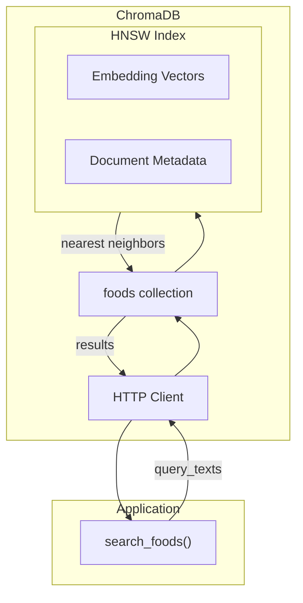
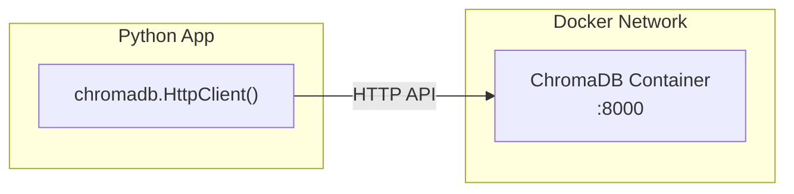
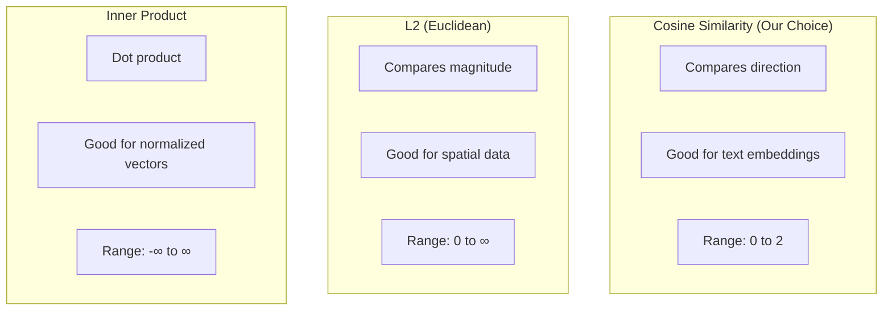
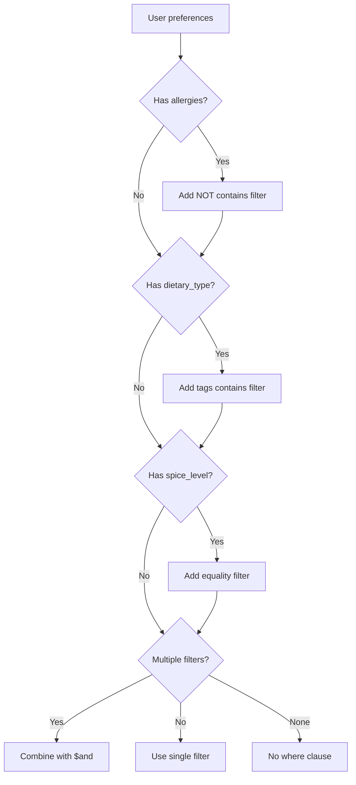
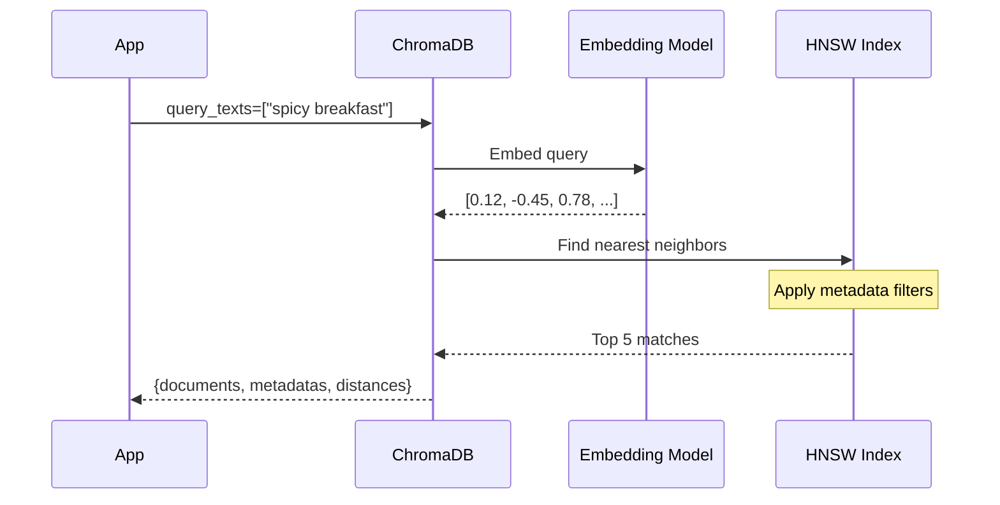
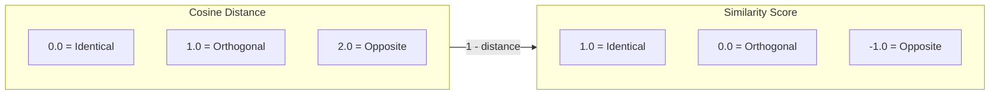
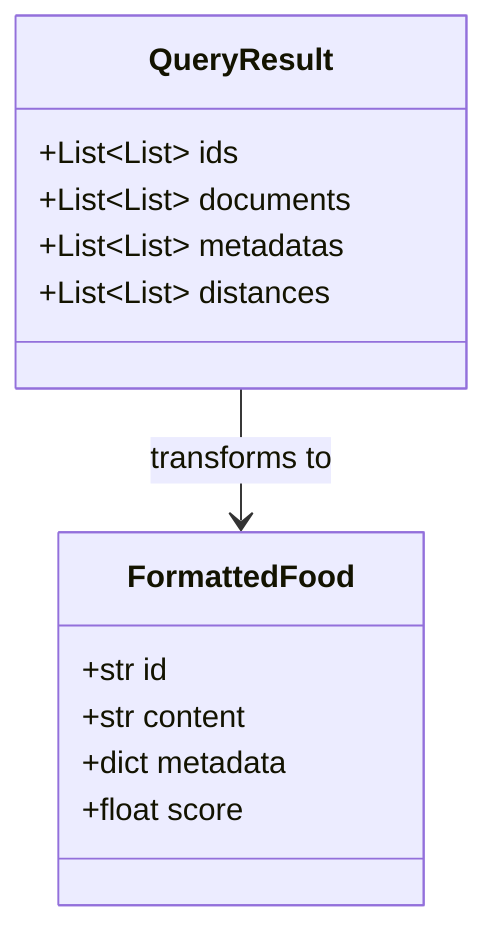

# retriever.py - Vector Search

The retriever is the heart of our RAG pipeline. It searches ChromaDB for semantically similar dishes based on user queries.

## Complete Source

```python title="backend/app/rag/retriever.py"
import chromadb
from chromadb.config import Settings as ChromaSettings
from app.core.config import settings


def get_chroma_client():
    return chromadb.HttpClient(
        host=settings.chroma_host,
        port=settings.chroma_port,
        settings=ChromaSettings(anonymized_telemetry=False),
    )


def get_collection():
    client = get_chroma_client()
    return client.get_or_create_collection(
        name=settings.chroma_collection,
        metadata={"hnsw:space": "cosine"}
    )


def search_foods(
    query: str,
    allergies: list[str] | None = None,
    dietary_type: str | None = None,
    cuisines: list[str] | None = None,
    spice_level: str | None = None,
    meal_type: str | None = None,
    n_results: int = 5,
) -> list[dict]:
    collection = get_collection()
    
    where_filters = []
    
    if allergies:
        for allergen in allergies:
            where_filters.append({"$not": {"allergens": {"$contains": allergen}}})
    
    if dietary_type:
        where_filters.append({"tags": {"$contains": dietary_type}})
    
    if spice_level:
        where_filters.append({"spice_level": spice_level})
    
    if meal_type:
        where_filters.append({"meal_type": meal_type})
    
    where = None
    if where_filters:
        if len(where_filters) == 1:
            where = where_filters[0]
        else:
            where = {"$and": where_filters}
    
    try:
        results = collection.query(
            query_texts=[query],
            n_results=n_results,
            where=where,
            include=["documents", "metadatas", "distances"],
        )
        
        foods = []
        if results["documents"] and results["documents"][0]:
            for i, doc in enumerate(results["documents"][0]):
                metadata = results["metadatas"][0][i] if results["metadatas"] else {}
                foods.append({
                    "id": results["ids"][0][i],
                    "content": doc,
                    "metadata": metadata,
                    "score": 1 - results["distances"][0][i] if results["distances"] else 0,
                })
        
        return foods
    except Exception as e:
        print(f"ChromaDB search error: {e}")
        return []
```

## Architecture Overview



## ChromaDB Connection

```python
def get_chroma_client():
    return chromadb.HttpClient(
        host=settings.chroma_host,  # "localhost" or "chroma" in Docker
        port=settings.chroma_port,  # 8000
        settings=ChromaSettings(anonymized_telemetry=False),
    )
```

**Connection types:**

- `HttpClient`: Connects to ChromaDB server (our approach)
- `PersistentClient`: Local persistence to disk
- `Client()`: In-memory (ephemeral)



## Collection Configuration

```python
def get_collection():
    client = get_chroma_client()
    return client.get_or_create_collection(
        name=settings.chroma_collection,  # "foods"
        metadata={"hnsw:space": "cosine"}
    )
```

The `hnsw:space` setting controls distance calculation:



## Filter Building



```python
where_filters = []

# Exclude allergens
if allergies:
    for allergen in allergies:
        where_filters.append({"$not": {"allergens": {"$contains": allergen}}})

# Include dietary type in tags
if dietary_type:
    where_filters.append({"tags": {"$contains": dietary_type}})

# Exact match for spice level
if spice_level:
    where_filters.append({"spice_level": spice_level})
```

### Filter Examples

```python
# User has dairy allergy
{"$not": {"allergens": {"$contains": "dairy"}}}

# User wants medium spice
{"spice_level": "medium"}

# Combined filters
{
    "$and": [
        {"$not": {"allergens": {"$contains": "dairy"}}},
        {"spice_level": "medium"},
        {"meal_type": "breakfast"}
    ]
}
```

## Query Execution

```python
results = collection.query(
    query_texts=[query],        # ["spicy breakfast"]
    n_results=n_results,        # 5
    where=where,                # Metadata filters
    include=["documents", "metadatas", "distances"],
)
```

**What happens internally:**



## Result Processing

```python
foods = []
if results["documents"] and results["documents"][0]:
    for i, doc in enumerate(results["documents"][0]):
        metadata = results["metadatas"][0][i] if results["metadatas"] else {}
        foods.append({
            "id": results["ids"][0][i],
            "content": doc,
            "metadata": metadata,
            "score": 1 - results["distances"][0][i] if results["distances"] else 0,
        })
```

**Why `1 - distance`?**

- ChromaDB returns cosine **distance** (lower = more similar)
- We want similarity **score** (higher = more similar)
- `score = 1 - distance` converts it



## Result Structure



**Raw ChromaDB result:**

```python
{
    "ids": [["food_1", "food_2", "food_3"]],
    "documents": [["Masala Dosa is...", "Upma is...", "Poha is..."]],
    "metadatas": [[{"name": "Masala Dosa"}, {"name": "Upma"}, {"name": "Poha"}]],
    "distances": [[0.15, 0.23, 0.31]]
}
```

**Formatted result:**

```python
[
    {"id": "food_1", "content": "Masala Dosa is...", "metadata": {"name": "Masala Dosa"}, "score": 0.85},
    {"id": "food_2", "content": "Upma is...", "metadata": {"name": "Upma"}, "score": 0.77},
    {"id": "food_3", "content": "Poha is...", "metadata": {"name": "Poha"}, "score": 0.69},
]
```

---

Next, let's look at the OpenAI client.
