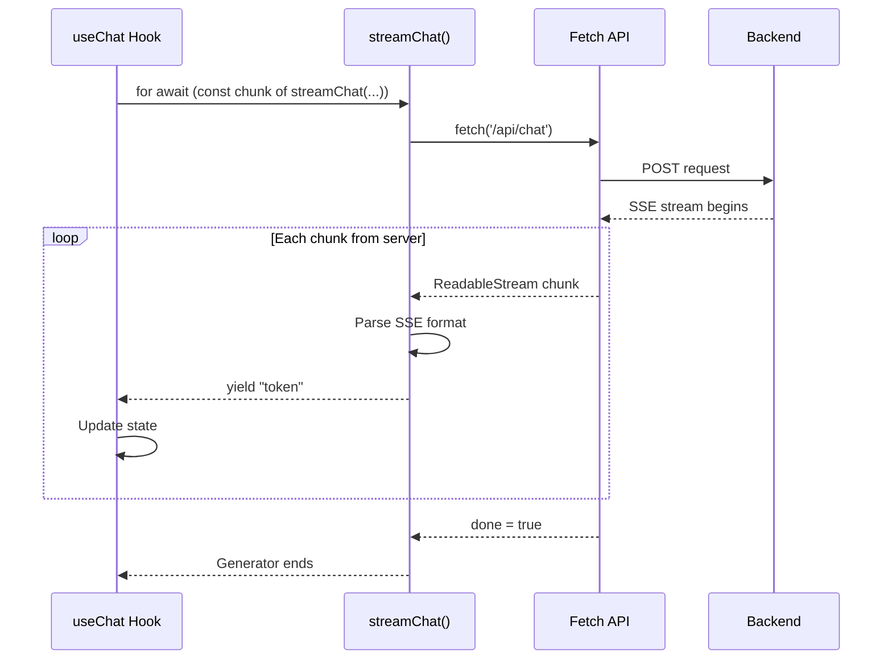
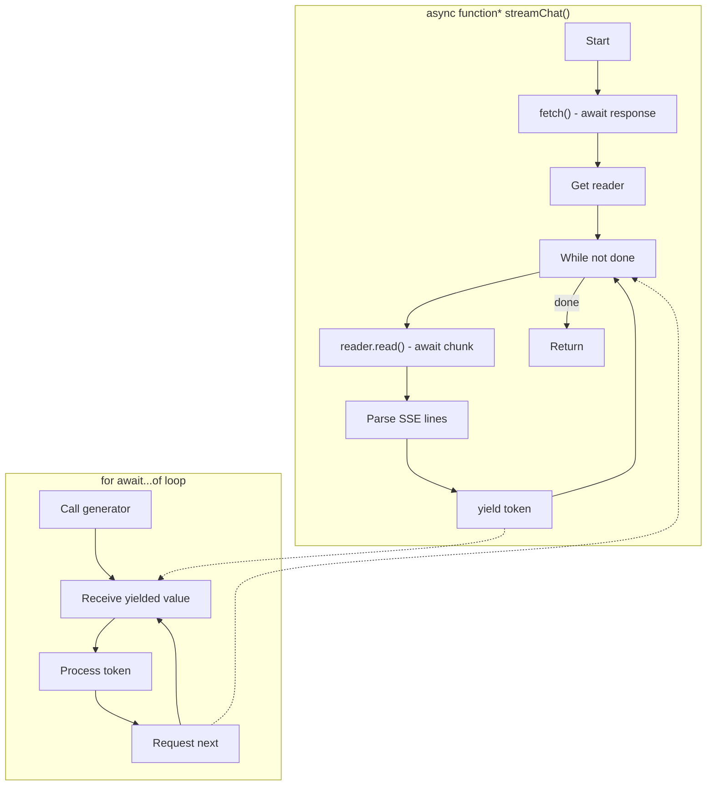
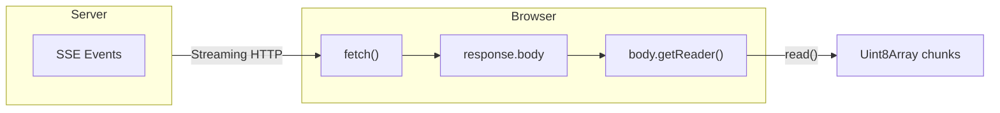
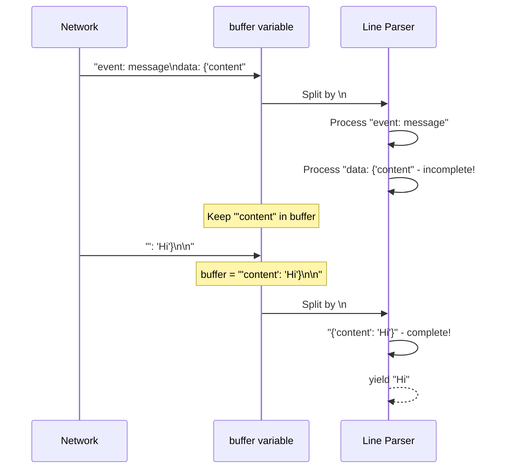
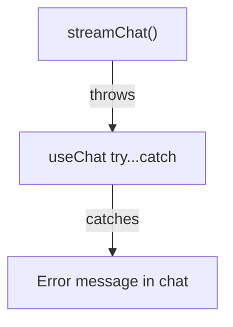

# api.ts - Frontend Streaming Client

This file handles the browser-side SSE (Server-Sent Events) consumption. It's an async generator that yields tokens as they arrive.

## Complete Source

```typescript title="frontend/src/lib/api.ts"
import type { Preferences } from '@/types'

export async function* streamChat(
    message: string,
    preferences: Preferences
): AsyncGenerator<string, void, unknown> {
    const response = await fetch('/api/chat', {
        method: 'POST',
        headers: { 'Content-Type': 'application/json' },
        body: JSON.stringify({ message, preferences }),
    })

    if (!response.ok) {
        throw new Error(`HTTP ${response.status}`)
    }

    const reader = response.body?.getReader()
    if (!reader) {
        throw new Error('No response body')
    }

    const decoder = new TextDecoder()
    let buffer = ''

    while (true) {
        const { done, value } = await reader.read()
        if (done) break

        buffer += decoder.decode(value, { stream: true })
        const lines = buffer.split('\n')
        buffer = lines.pop() || ''

        for (const line of lines) {
            if (line.startsWith('data:')) {
                const data = line.slice(5).trim()
                if (data) {
                    try {
                        const parsed = JSON.parse(data)
                        if (parsed.content) {
                            yield parsed.content
                        }
                    } catch {
                        // Ignore parse errors
                    }
                }
            }
        }
    }
}
```

## Async Generator Pattern



## How async* Generators Work



**Key concept**: The `yield` keyword pauses the generator and returns a value to the consumer. When the consumer asks for the next value, the generator resumes.

## ReadableStream API



```typescript
const reader = response.body?.getReader()

while (true) {
    const { done, value } = await reader.read()
    if (done) break
    
    // value is Uint8Array
    const text = decoder.decode(value, { stream: true })
}
```

## SSE Parsing

```mermaid
flowchart TB
    subgraph Raw["Raw SSE Data"]
        R1["event: message\ndata: {'content': 'Hello'}\n\nevent: message\ndata: {'content': ' world'}\n\n"]
    end
    
    subgraph Lines["Split by \\n"]
        L1["event: message"]
        L2["data: {'content': 'Hello'}"]
        L3[""]
        L4["event: message"]
        L5["data: {'content': ' world'}"]
    end
    
    subgraph Tokens["Yielded Tokens"]
        T1["'Hello'"]
        T2["' world'"]
    end
    
    Raw --> Lines --> Tokens
```

```typescript
buffer += decoder.decode(value, { stream: true })
const lines = buffer.split('\n')
buffer = lines.pop() || ''  // Keep incomplete line in buffer

for (const line of lines) {
    if (line.startsWith('data:')) {
        const data = line.slice(5).trim()  // Remove "data:" prefix
        if (data) {
            const parsed = JSON.parse(data)
            if (parsed.content) {
                yield parsed.content
            }
        }
    }
}
```

## Buffer Management



Why buffer management matters:

- Network chunks don't align with SSE message boundaries
- A message might be split across multiple chunks
- The buffer holds incomplete lines until the rest arrives

## Error Handling

```typescript
if (!response.ok) {
    throw new Error(`HTTP ${response.status}`)
}

const reader = response.body?.getReader()
if (!reader) {
    throw new Error('No response body')
}
```

Errors propagate to the `catch` block in the `useChat` hook:



## Comparison with EventSource

| Approach | Our Code | EventSource API |
|----------|----------|-----------------|
| HTTP method | Any (POST) | GET only |
| Request body | Yes | No |
| Headers | Full control | Limited |
| Reconnection | Manual | Automatic |
| Complexity | More code | Simpler |

We use fetch because we need:

- **POST method**: To send message body
- **Custom headers**: Content-Type
- **Request body**: JSON payload

```typescript
// EventSource (can't do POST)
const es = new EventSource('/api/chat')

// Our approach (full control)
const response = await fetch('/api/chat', {
    method: 'POST',
    body: JSON.stringify({ message, preferences }),
})
```

---

This completes the file walkthrough section. Next, test the documentation by running `bun start` in the docs folder.
