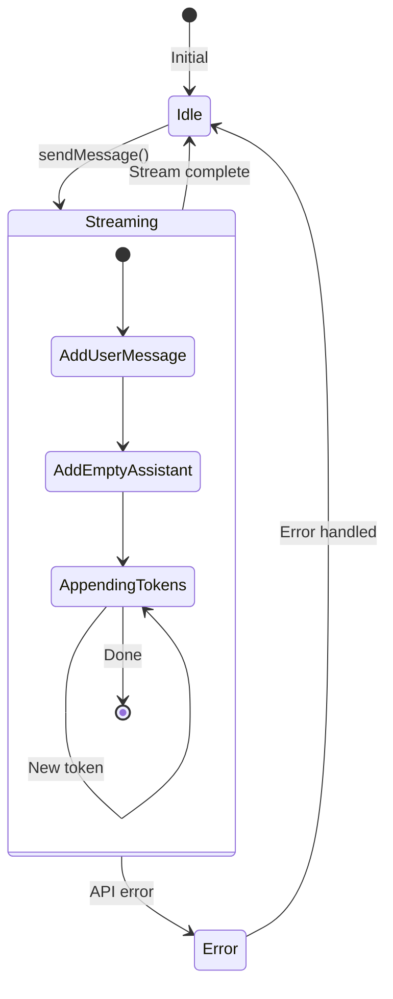
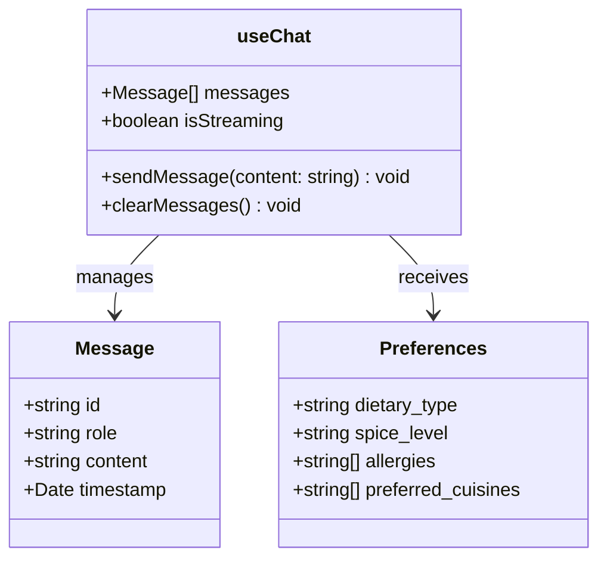
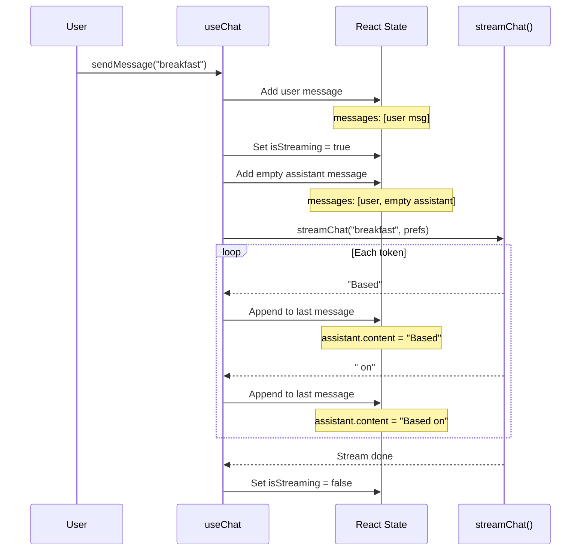
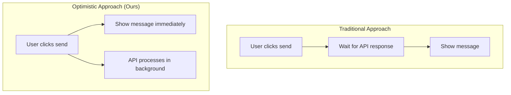
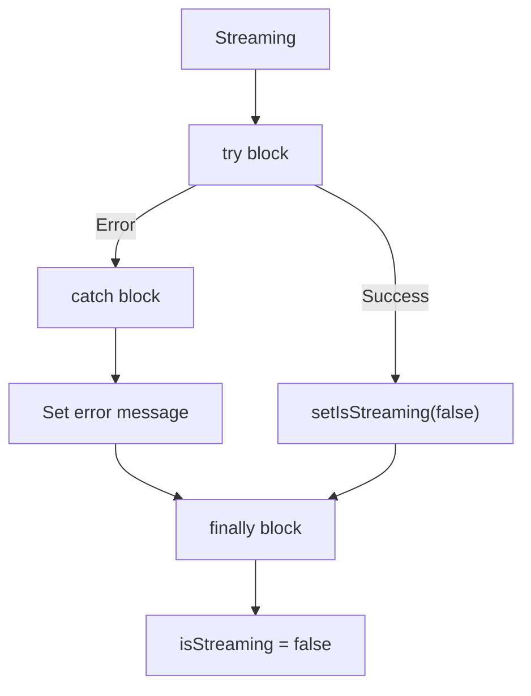
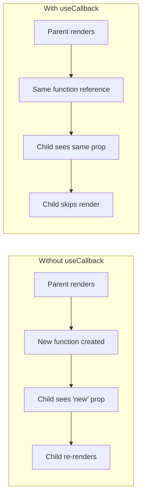

# useChat.ts - Frontend State Management

This React hook manages all chat state and streaming logic. It's the bridge between UI and API.

## Complete Source

```typescript title="frontend/src/hooks/useChat.ts"
import { useState, useCallback } from 'react'
import type { Message, Preferences } from '@/types'
import { streamChat } from '@/lib/api'

export function useChat(preferences: Preferences) {
    const [messages, setMessages] = useState<Message[]>([])
    const [isStreaming, setIsStreaming] = useState(false)

    const sendMessage = useCallback(async (content: string) => {
        const userMessage: Message = {
            id: crypto.randomUUID(),
            role: 'user',
            content,
            timestamp: new Date(),
        }

        setMessages(prev => [...prev, userMessage])
        setIsStreaming(true)

        const assistantMessage: Message = {
            id: crypto.randomUUID(),
            role: 'assistant',
            content: '',
            timestamp: new Date(),
        }

        setMessages(prev => [...prev, assistantMessage])

        try {
            for await (const chunk of streamChat(content, preferences)) {
                setMessages(prev => {
                    const updated = [...prev]
                    const lastIdx = updated.length - 1
                    updated[lastIdx] = {
                        ...updated[lastIdx],
                        content: updated[lastIdx].content + chunk,
                    }
                    return updated
                })
            }
        } catch (error) {
            console.error('Stream error:', error)
            setMessages(prev => {
                const updated = [...prev]
                const lastIdx = updated.length - 1
                updated[lastIdx] = {
                    ...updated[lastIdx],
                    content: 'Sorry, something went wrong. Please try again.',
                }
                return updated
            })
        } finally {
            setIsStreaming(false)
        }
    }, [preferences])

    const clearMessages = useCallback(() => setMessages([]), [])

    return { messages, isStreaming, sendMessage, clearMessages }
}
```

## State Machine



## Hook Interface



## Message Flow



## Optimistic Updates



```typescript
// Immediately add user message (optimistic)
setMessages(prev => [...prev, userMessage])

// Then make API call
for await (const chunk of streamChat(...)) { ... }
```

Benefits:

- **Feels instant**: User sees their message immediately
- **No blocking**: UI stays responsive
- **Better UX**: Matches expectations from apps like ChatGPT

## Token Appending

```typescript
for await (const chunk of streamChat(content, preferences)) {
    setMessages(prev => {
        const updated = [...prev]
        const lastIdx = updated.length - 1
        updated[lastIdx] = {
            ...updated[lastIdx],
            content: updated[lastIdx].content + chunk,  // Append token
        }
        return updated
    })
}
```

**Why functional update?**

```typescript
// ❌ This can cause stale state issues
setMessages([...messages, newMsg])

// ✅ This always uses the latest state
setMessages(prev => [...prev, newMsg])
```

The functional form (`prev => ...`) guarantees you're working with the latest state, crucial for rapid updates during streaming.

## Error Handling



```typescript
try {
    for await (const chunk of streamChat(...)) {
        // Append tokens
    }
} catch (error) {
    console.error('Stream error:', error)
    setMessages(prev => {
        const updated = [...prev]
        const lastIdx = updated.length - 1
        updated[lastIdx] = {
            ...updated[lastIdx],
            content: 'Sorry, something went wrong. Please try again.',
        }
        return updated
    })
} finally {
    setIsStreaming(false)  // Always runs
}
```

## useCallback Dependency

```typescript
const sendMessage = useCallback(async (content: string) => {
    // ...uses preferences
}, [preferences])  // Re-create when preferences change
```

`useCallback` memoizes the function:

- Same function reference if `preferences` unchanged
- Prevents unnecessary re-renders of child components



## Integration with App.tsx

```typescript title="App.tsx usage"
function App() {
    const [preferences, setPreferences] = useState<Preferences>(...)
    
    // Hook provides all chat state
    const { messages, isStreaming, sendMessage, clearMessages } = useChat(preferences)
    
    return (
        <div>
            {messages.map(msg => <ChatMessage message={msg} />)}
            <ChatComposer onSend={sendMessage} disabled={isStreaming} />
        </div>
    )
}
```

---

Next, let's look at the frontend streaming API client.
