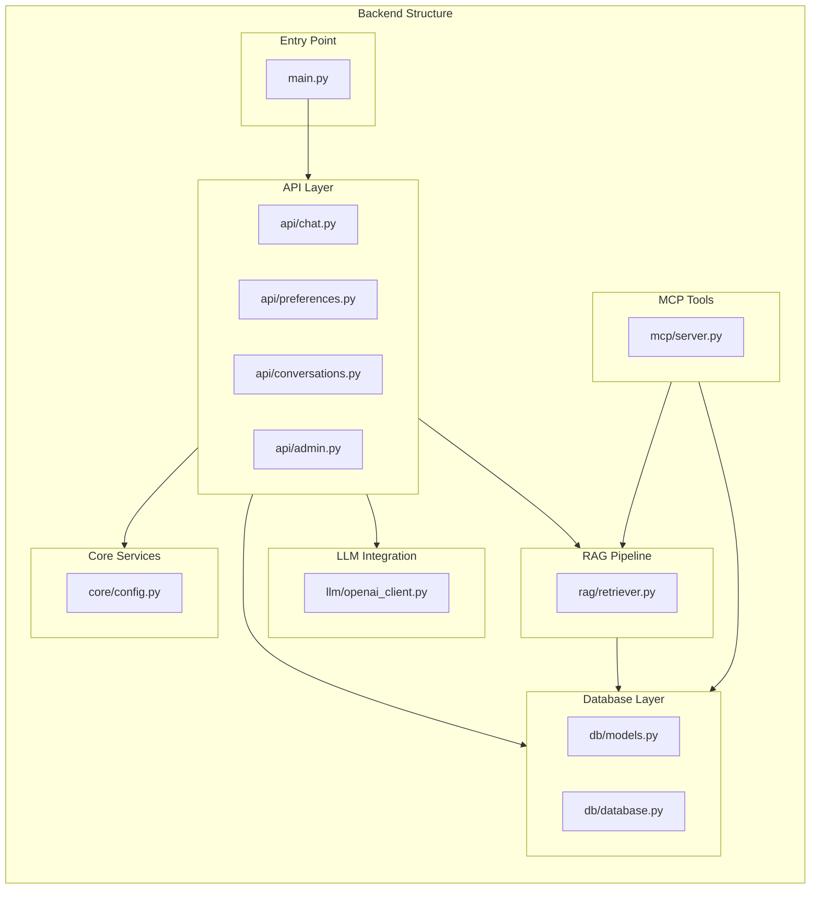
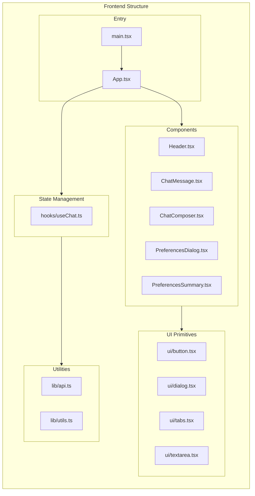
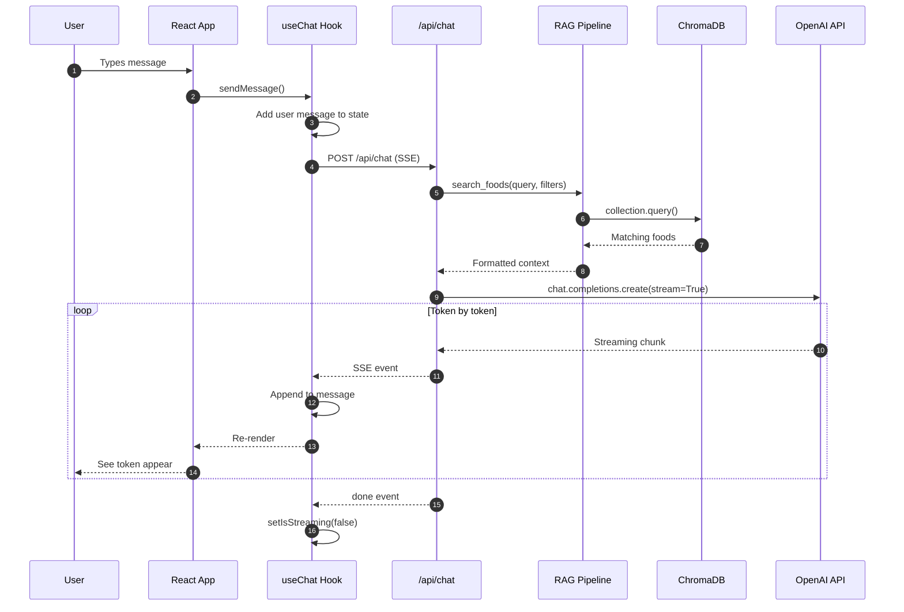

# Complete File Walkthrough

This section provides a detailed explanation of every file in the application. Understanding each piece helps you build similar applications from scratch.

## Backend Architecture

## Frontend Architecture

## Data Flow

---

## Detailed File Explanations

### Backend Files

Each file is explained with its purpose, key functions, and how it connects to other parts.
